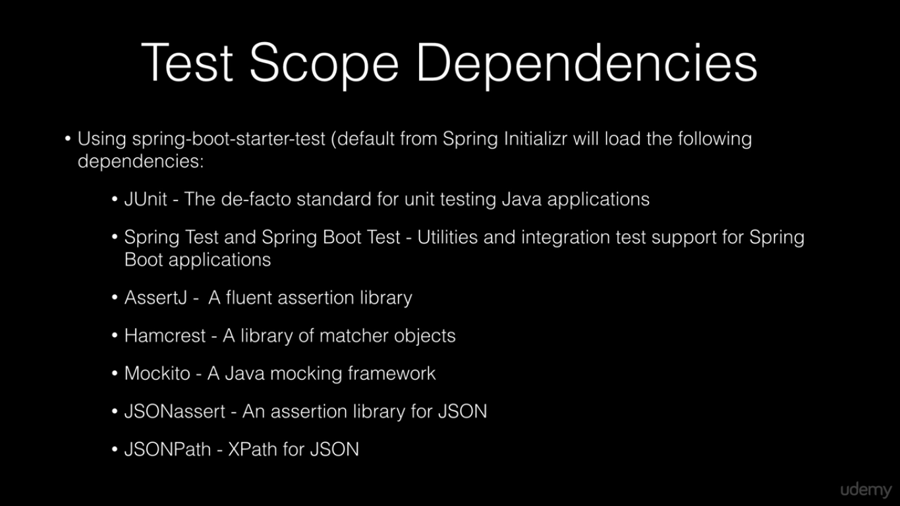
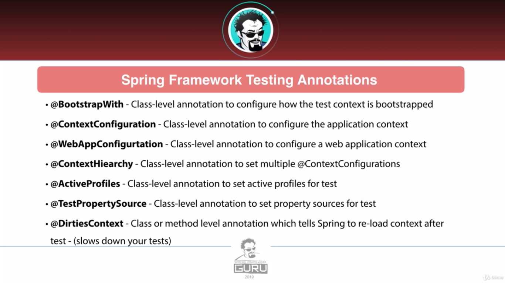
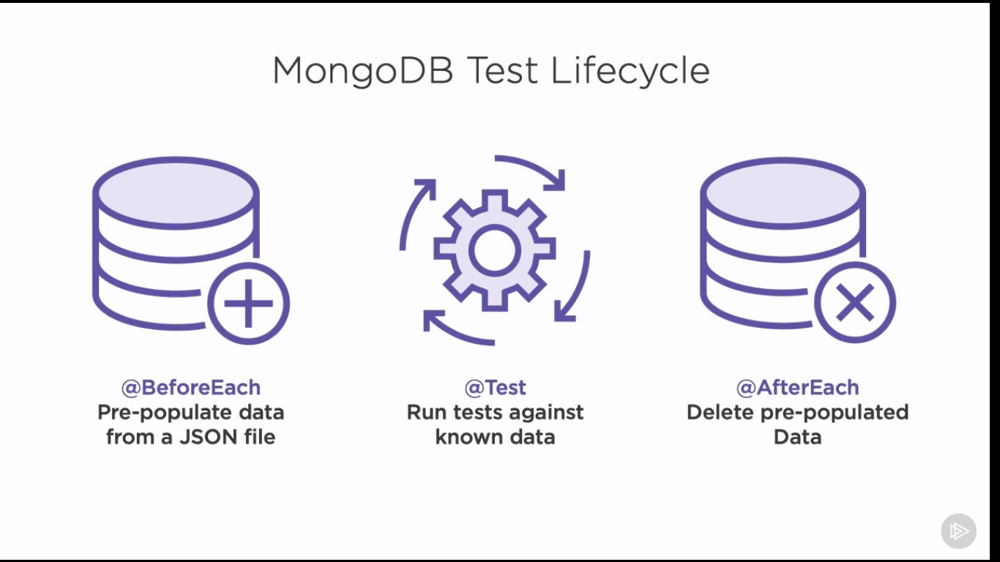

# Testing Using Spring Framework

## Terminology





> Pure Junit & Mockito notes are available in core module.

### Spring specific tests





## Spring boot support for junit

Spring provides tools to enhance the productivity of writing unit tests. Spring gives us three configurations:

* SpringBootTest: Loads the application context into tests
* MockMVC: comprehensive testing of controller units
* Mockito Integration: @MockBean for easy mockito integration

Also provides tool for testing third party backend resources:

* DBUnit: Pre populate and clean up database between tests
* MongoDB: manage MongoDB data
* WireMock: simulate third party API responses

### Spring Testing Context

We want to use SpringApplicationContext to handle our objects and Junit features. We can `autowire` objects.

#### Setup

We need to put `@SpringJunitConfiguration` annotation which provides needed annotations for us. We can pass
Configuration
classes to this annotation. These classes can be defined isolated or as inner classes.

WE can use `@ActiveProfile` and `@Profile` for using profiles for tests.

We can also use `@TestPropertySource` for external properties.

### Spring MVC Tests

#### MockMVC

Spring has a feature for testing controllers. Old days we had to bring the whole web server up for testing it, but
now we can mock web server. Actually we are not going to mock web server, we just mock the dispatcher servlet.
We can configure it in different ways:


* standalone which is for TDD
* WebAppContext which is for BDD.

Now we pass the test subject to it and build. We use perform method and pass the http method we want and chain the
andExpect() method to it.

```java
MockMVC mockmvc=MockMVCBuilders.standAloneSetup(controller).build();
        mockmvc.perform(get("/")).andExpect(status.isOk()).andExpect(view().name("index"));
```

We can also chain model test with andExpect() function to test the Model attributes.

### Service Layer test


### Repository Layer test

#### Using JDBC template


#### Using spring Data for NOSQL database





### Testing using WireMock


#### Spring Integration Tests


In order to do some integration tests we annotate the class `@RunWIth(Spring.class)` and if it's a database
operation we can use `@DataJPATest` which brings entity manager.

