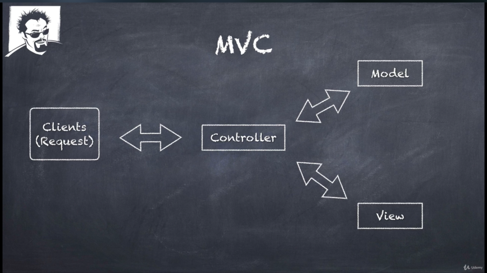
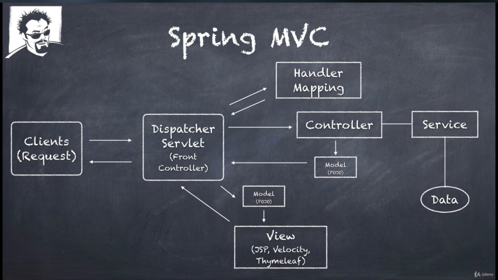

## Spring MVC

***

### What is MVC

* A design pattern for GUI and Web applications.
* Model
* View
* Controller
  
  

### Resources

Resources directory in maven structure has two
subdirectories:

* static: We keep static resources like images & fonts
* templates: We keep template files like html pages here.

> `Application.properties` and other configs can be found here too.
