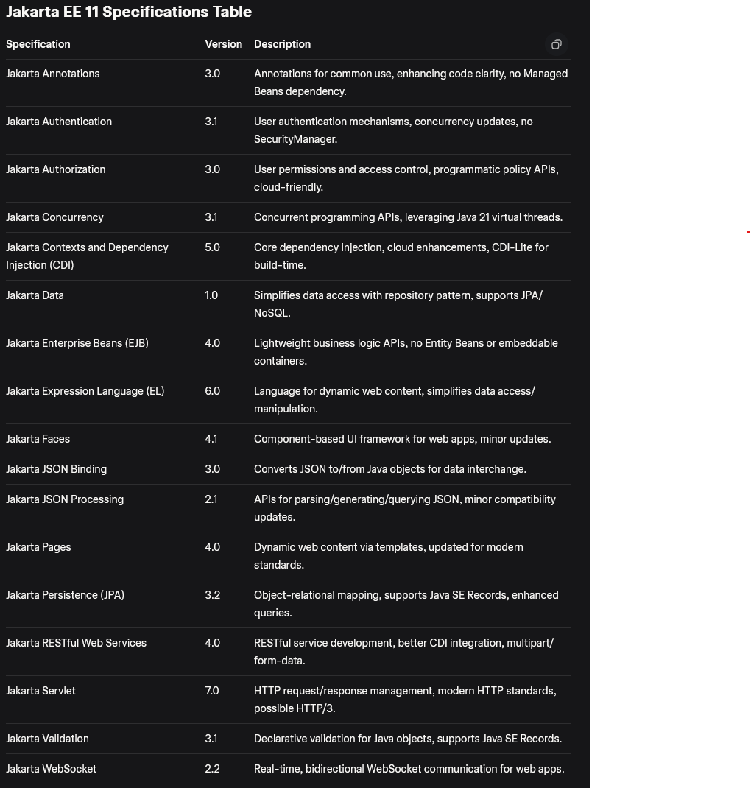

# What's JakartaEE or JavaEE

JakartaEE platform or former JavaEE is set of specifications(JSRs) that are provided for building complex applications.
These specifications are solutions for complex problems so we don't invent the wheel using Java core. For example
accessing NoSQL databases, having Dependency injection, handling Restful services and ...

This is the list of JakartaEE11 specifications:

## JakartaEE Containers

A container is a runtime component of a Jakarta EE application server that manages specific types of application
components, providing standardized services like:

- Lifecycle management (creation, execution, destruction of components).
- Dependency injection (via CDI).
- Transaction management (via JTA).
- Security (via Jakarta Authentication and Authorization).
- Concurrency utilities (via Jakarta Concurrency).

### Web Container

The Web Container handles HTTP requests and responses, serving as the runtime for web applications. It processes
incoming HTTP requests, routes them to the appropriate servlet or JSP, and manages sessions, filters, and listeners. It
also supports WebSocket for real-time communication and integrates with CDI for dependency injection.

### EJB Container

Encapsulates business logic. The EJB Container provides a runtime for session beans (stateless/stateful), message-driven
beans, and (historically) entity beans, though entity beans are removed in Jakarta EE 11. It handles transaction
management, security, concurrency, and pooling of EJB instances, making it ideal for enterprise-grade business logic.

### CDI Container

This is the backbone of dependency injection in JakartaEE. Enables dependency injection across other components (e.g.,
Servlets, EJBs, REST resources). The CDI Container manages the lifecycle of CDI beans,
providing dependency injection, context management (e.g., request, session, application scopes), and event handling.
It’s a core component model in Jakarta EE 11, replacing older models like Managed Beans.

### Application Client Container (ACC)

Supports client-side Java applications that interact with Jakarta EE servers. The ACC provides a lightweight runtime for
standalone Java SE clients that access EJB or other server-side components. It manages resource injection and security
for client applications.

For example a desktop Java application invoking EJB methods on a remote server.

> Containers work together seamlessly. For example, a servlet in the Web Container can inject a CDI bean, which in turn
> can invoke an EJB managed by the EJB Container, all within a single transaction.

## Java Application Servers

Application servers are software platforms that implement the Jakarta EE specifications, providing the runtime
environment (containers) for Jakarta EE applications.

- WebLogic
- Glassfish
- WebSphere
- Tomcat
- TomEE
- Jetty

Developers package applications as WAR (Web Archive) for Web Profile or EAR (Enterprise Archive) for full Platform,
which are deployed to the application server. The server’s containers manage the components within these archives.

Jakarta EE specifications originate from JSRs (Java Specification Requests), which define APIs and behaviors but not the
implementation. Application servers choose or provide implementations to meet these specs.

### GlassFish

GlassFish: Uses the RIs for most specs (e.g., EclipseLink for JPA, Jersey for REST, Weld for CDI), as it’s the reference
server for Jakarta EE 11.

### Wildfly

May use RIs or custom implementations optimized for performance. For example, it uses Hibernate for JPA (instead of
EclipseLink) and RESTEasy for RestFul Web Services (instead of Jersey).

### WebLogic

Often uses Oracle-specific implementations (e.g., Oracle’s JPA provider) but ensures TCK compliance for portability. It
may bundle RIs or proprietary alternatives.

## Difference between Web server and Java application server

| **Aspect**           | **Web Server**                       | **Application Server**                    |
|----------------------|--------------------------------------|-------------------------------------------|
| **Purpose**          | Serve static content, proxy requests | Run full Jakarta EE applications          |
| **Jakarta EE Specs** | None                                 | All (Servlet, Pages, EJB, CDI, JPA, etc.) |
| **Components**       | Static files, CGI, proxies           | Web components, EJBs, CDI beans, etc.     |
| **Examples**         | Apache HTTP, Nginx                   | GlassFish, WildFly, WebLogic              |
| **Scope**            | HTTP traffic, lightweight            | Enterprise-grade, full-stack              |
| **Containers**       | None                                 | Web, EJB, CDI, and others                 |

> static (passive) web contents are files like images, gifs, html, css files. However, Dynamic (active) contents are the
> result of a program running on the server like CGI or Java that creates the result.

## Web module

There's a standard structure for application servers to run our web modules. The name of directories or paths may differ
in different application servers but the total Concept is common.

### WEB-INF

This is one of the important directories that contains web.xml(deployment descriptor) file which describes how the web
module gets deployed.

It can contain `classes` directory that contains bytecode of classes or `lib` to contain JAR files.

> It's recommended to put JSP files under WEB-INF to prevent clients to route directly to them as they may contain
> important information

### META-INF

This directory contains `context.xml` files that describe the context information.

### war file

Files needed to be served by application server can be put in a default path or told the location. This is called
Exploded however we can archive them in a .war format and application server understand that.

> It's configurable for application server to make the war exploded each time or not. it's considerable for performance
> issues.

## Deployment

The process of deployment is the definition of installing our application on serverContext.

It takes further steps:

1. load descriptors(web.xml) or scan classes for annotations
2. Creating Servlet Context per module.
3. Creating resources for application servers like creating object of servlets, filters, listeners and ...

### ServletContext

It's an object that contains all the information like what servlets, filters, sessions, requests instances are created
in module.

### Context path

We can separate different modules with a path in the URL which we call ContextPath that is used to route requests to
different modules of application.
