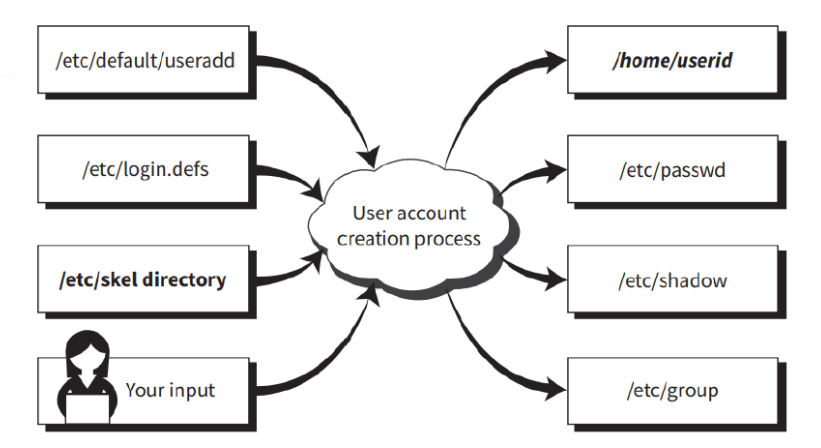
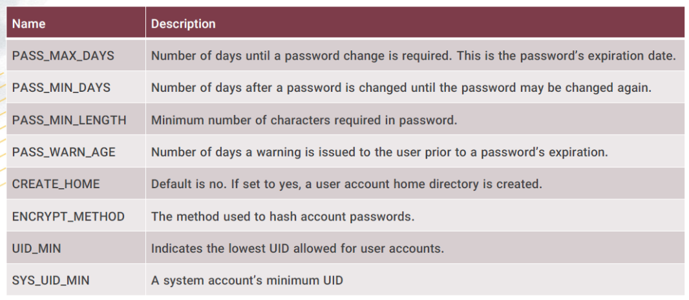
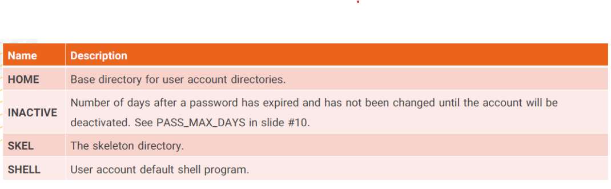

# Configuring User accounts

## Account Types

For ordinary users we have normal(local) accounts Which is a accissible via authorized human and appropriate credentials.

We also have system users which are accounts that provide services.

## /etc/login.defs

This file contains policies that deal with shadow password suit commands. like password length, time for user to change the password and ...

## /etc/default/useradd

This is another file that directs the process of creating accounts.

## /etc/skel

This directory is a skeleton which we can use to put common files between all users during creation in their home directory.
This directory contains .bash_logout, .bash_profile, .bashrc files.

## /etc/passwd

Account information is stored in this file.

`root:x:0:0:root:/root:/bin/zsh`

1. username
2. password -> The x is just a representive, the actual hash of password is stored inside `/etc/shadow` file.
3. UID
4. GID
5. comment field
6. home directory
7. default shell

## /etc/shadow

This file also stores password details of an account in a single line:

`root:!::0:99999:8:::`

1. username
2. password -> ! or !! represents no password, if ! is behind the hash of password means the account is locked.
3. date of last password change
4. number of days after a password is changed until the password may be changed again
5. number of days until a password change is required
6. number of days a warning is issued to the user prior to a password expiration
7. number of days after a expired password has to change before getting deactivated
8. date of account expiration(days)
9. special flag

## Commands

We can use `useradd` for creating, `getent` to get the data of user in the shadow related files. `passwd` to maintain password. `chage` to change user password expiry information. `usermod` to modify user account. `userdel` to delete a user.
We can use `groupadd`, `groupmod` and `groupdel` to modify user groups. We can also view a user groups using `groups` command.
